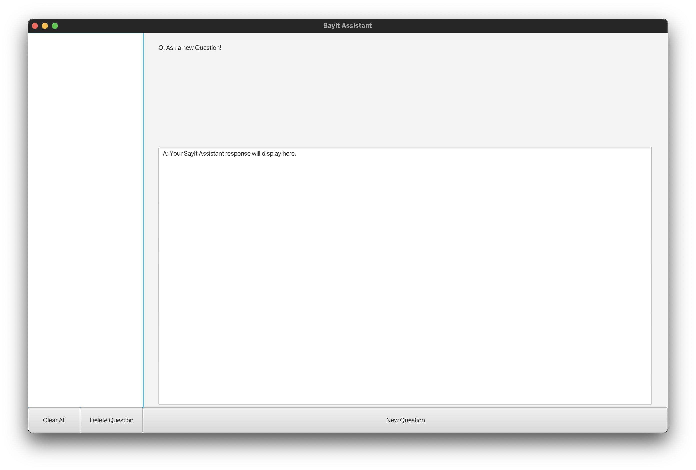

# SayIt Assistant
#### By Agile Lovers

*Team 4: Louie Cai, Anish Govind, Lilian Kong, Nicholas Lam, Billy Phan, Shera Zhong*

---

## Prerequisite installations
Our project is running on **JDK 20** and utilizes **Maven** as our package manager. Please make sure you have these installed on your machine before running our project ( *If you're running Linux or MacOS, you can use Homebrew to install Maven (https://maven.apache.org))*.

## Instructions to run

In other to build and run our project, install our project by:
1. click on `Code`
2. click on `Download ZIP`

Next, go to the default download directory and unzip the project file into a directory of your choosing. 

Open your terminal and go to the directory where you unzipped the file. Run the following command:
```
mvn javafx:run -f pom.xml
```

Once you've run this command, a window should appear on your screen. It should look like:


---

# How to use the "SayItAssistant" app
Generating an AI generated response to a recorded query (question/statement). 

The purpose of the **SayItAssistant** application is to let the user speak out loud their question or statement. Within seconds, a response should be displayed on the screen according to their question or statement. 

On our application, there are several buttons the user should know about:
1. "New Question"
   * the button initiates a recording for the user 
   * The user should start speaking their question or statement 
   * Once the user is finished with their query, click "End Recording"
2. "Delete Question"
   * The user should click on the question they wish to delete
   * Once the user has selected their question, click on the "Delete Question" button
3. "Clear All"
   * Clears all questions from the question list and no questions should be displayed

---

## Milestone 1 Delivery Checklist

#### Software design – 10 points
- [x] tidy code (indented, consistent naming, file-/method-level comments as needed) (1 pts)
- [x] classes other than Activities (2 pts)
- [] wide use of SRP and DRY (5 pts) 
- [x] code sounds like the requirements (2 pts)

#### Demo: satisfaction of all milestone requirements – 35 points [priority] - points:

- [x] Story 1: **Ask a question** [H] - 12 pts 
  - As a user I want the app to display an answer when I ask a question verbally so that I don’t have to type in my questions

- [x] Story 2: **Copy and paste answers** [M] - 2 pts 
  - As a user I want copy parts of an answer so that I can paste them into another program like Google Documents so that I can add part of the answer to my research paper

- [x] Story 3: **Browse question prompt history** [H] - 5 pts 
  - As a user I want to be able to view a list of past questions so that I can see what questions I already asked

- [x] Story 4: **Persistence of old prompts and answers** [M] - 2 pts 
  - As a user I want older questions and answers to still be available after the program is killed and restarted so that I can find the information and topics again

- [x] Story 5: **Read old question prompt and answer** [H] - 5 pts 
  - As a user I want to be able to view the answer to a past question when I click on it the question history so that I can review a previous answer

- [x] Story 6: **Delete old question prompt and answer** [M] - 3 pts 
  - As a user I want to be able to select a past question and then delete it so that I can remove unneeded questions so I can more easily find important information

- [x] Story 7: **Clear all older question prompts and answers** [M] - 3 pts 
  - As a user I want to be able to clear all past questions when I no longer need them so that I can prevent my screen from being cluttered when researching new topics

- [x] Story 8: **Scalable to work on multiple platforms** [M] - 3 pts
*Details for Story 8:*
- We won’t actually be doing multiple platforms due to the lack of time.
- The best way to accomplish this and cut development time is to use a 3 (or more) tier architecture that separates the front-end from the middleware and backend. 
- For a program that is supported by multiple platforms:
  - the middleware should be hosted on a server (such as an HTTP server) so that only the front-end needs to be created for each platform
  - the middleware and backend would stay the same, reducing development time for both new UIs as well as business logic updates.

#### Testing – 25 points
- [ ] Tests with non-trivial testing-class coverage (all testable non-trivial methods tested, e.g., can exclude field getter/setter methods) (15 pts)
- [x] Local testing: All tests automated, tied into JUnit (run and show pass/fail) (5 pts)
- [x] Continuous Integration: All tests run on GitHub Actions (5 pts)


#### Github Project – 9 points
- [ ] User Stories started in priority order; iterations run in sequence (3 pts)
- [x] Tasks assigned to developers, all team members assigned tasks (3 pts)
- [x] Burndown chart looks good (steady progress, not all work at end) (3 pts)

#### GitHub - 10 points
- [x] Consistent use, all team members contributed (4 pts)
- [x] Each push labelled with its GitHub Project issue number (2 pts) 
- [x] Protected master branch (pull requests passed tests on GitHub Actions and passed code review) (2 pts)
- [x] Merged protected branch story-by-story (2 pts)
